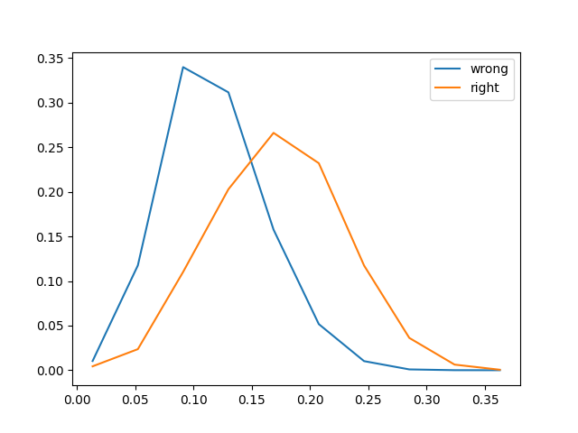

# Little-Scripts
small scripts I want to back up somewhere

## blind75.py
Picks a random problem from the popular [blind 75 list](https://leetcode.com/discuss/general-discussion/460599/blind-75-leetcode-questions) on leetcode, gives you the URL. Go solve it. 

## coupon_collector.py
Proving the number of packs required to open using a monte carlo method for the [coupon collector problem](https://en.wikipedia.org/wiki/Coupon_collector%27s_problem)

## uncertainty_histograms.py
Lets you graph out the distribution of the predicted scores from a neural net, and compare the ones that were correctly classified against those that were incorrectly classified. Generates something like below. The y axis is not to scale - otherwise there would be a very small peak in comparison to the 'right' points. The functions in this file need to be included in your code so that they are used, but should be readable enough so that you can figure out where to plug it in.

